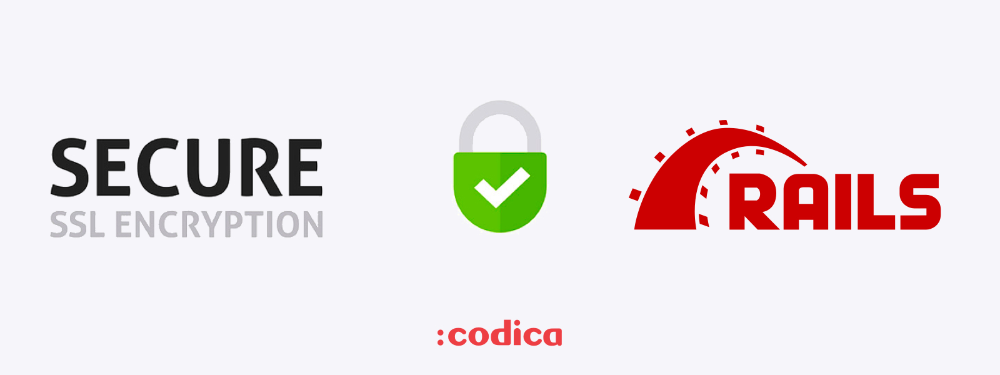
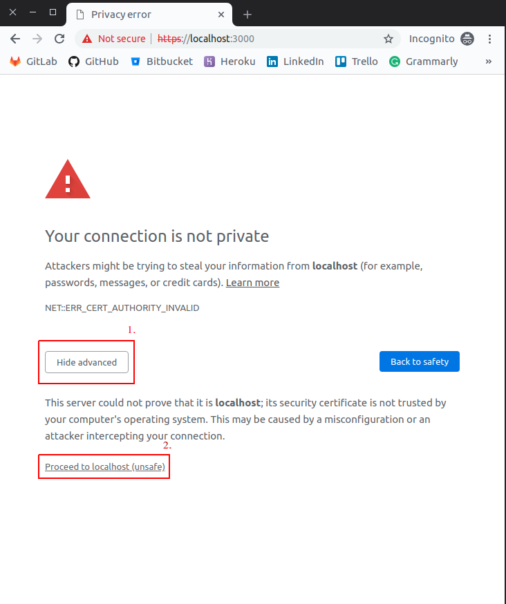

# How to use self-signed SSL certificate for local development on Rails

<p align='center'>
  
</p>

SSL (Secure Sockets Layer) is the standard security technology for establishing an encrypted link between a web server and a browser.

## In short

```bash
$> openssl req -x509 -sha256 -nodes -newkey rsa:2048 -days 365 -keyout localhost.key -out localhost.crt
$> rails s -b 'ssl://localhost:3000?key=localhost.key&cert=localhost.crt'
```

## Why you may need SSL in development?

Check this [tweet](https://twitter.com/getify/status/1023202051902373888) to find the answer.

Short summary:

- No mixed-content warnings
- Using features / third-party integrations that require SSL
- URL logic (routing, history, redirects)

## Let's rock

Firstly, start the server and make sure that the HTTPS connection is not established.

```bash
$> rails s

=> Booting Puma
=> Rails 5.2.3 application starting in development
=> Run `rails server -h` for more startup options
Puma starting in single mode...
* Version 3.12.1 (ruby 2.5.1-p57), codename: Llamas in Pajamas
* Min threads: 5, max threads: 5
* Environment: development
* Listening on tcp://localhost:3000
Use Ctrl-C to stop
```

Browser:

<p align='center'>
  
</p>

Puma logs:

```bash
---
xxx: HTTP parse error, malformed request (): #<Puma::HttpParserError: Invalid HTTP format, parsing fails.>
---
```

## Step one: generate the cert

```bash
$> openssl req -x509 -sha256 -nodes -newkey rsa:2048 -days 365 -keyout localhost.key -out localhost.crt
```

> NOTE: you can change days parameter (365) for any number to affect the expiration date.

You will be provided with some information fields to fill in about country key, email, etc. However, you can skip this step. This command will create two new files `localhost.key` and `localhost.crt` in the current directory. You can move these files anywhere.

## Step two: run a server with the certificate

```bash
$> rails s -b 'ssl://localhost:3000?key=localhost.key&cert=localhost.crt'

=> Booting Puma
=> Rails 5.2.3 application starting in development
=> Run `rails server -h` for more startup options
Puma starting in single mode...
* Version 3.12.1 (ruby 2.5.1-p57), codename: Llamas in Pajamas
* Min threads: 5, max threads: 5
* Environment: development
* Listening on ssl://localhost:3000?key=localhost.key&cert=localhost.crt
Use Ctrl-C to stop
```

Browser:

<p align='center'>
  
</p>

> NOTE: Firstly, click 'ADVANCED' (i) and then 'Proceed to localhost (unsafe)' (ii).

<p align='center'>
  
</p>

Puma logs:

```bash
...

Started GET "/" for ::1 at 2019-04-16 16:02:11 +0300
Processing by Rails::WelcomeController#index as HTML
  Rendering rails/templates/rails/welcome/index.html.erb
  Rendered rails/templates/rails/welcome/index.html.erb (2.6ms)
Completed 200 OK in 6ms (Views: 4.7ms | ActiveRecord: 0.0ms)

...
```

## License

Copyright © 2015-2019 Codica. It is released under the [MIT License](https://opensource.org/licenses/MIT).

## About Codica

[](https://www.codica.com)

We love open source software! See [our other projects](https://github.com/codica2) or [hire us](https://www.codica.com/) to design, develop, and grow your product.